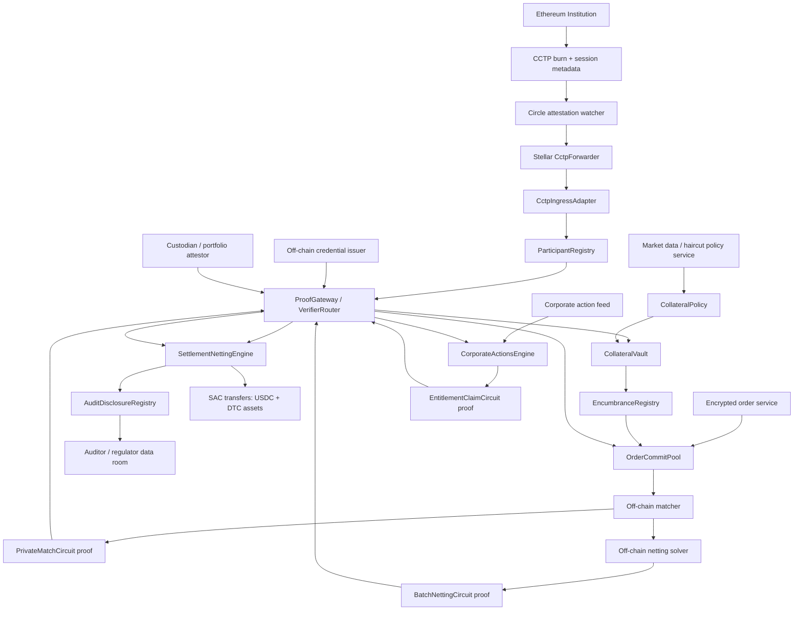

# Production Plan: ZK Private Institutional Trading & Settlement Layer on Stellar

## Summary And Ground Truth

Build a Stellar-native institutional privacy layer for DTC-tokenized assets: Ethereum-side USDC liquidity enters via CCTP, institutions prove eligibility/collateral privately, commit orders privately, match and settle on Stellar, support netting and later corporate actions, and expose regulator/auditor reconstruction through selective disclosure.

Confirmed source constraints:
- DTCC/DTC expects tokenized DTC-custodied assets on Stellar in **H1 2027**, with full asset lifecycle support including corporate actions and reporting: [DTCC release](https://www.dtcc.com/news/2026/may/27/tokenization-service-to-connect-with-stellar-public-blockchain-as-dtc-advances-its-multi-chain-strategy), [Stellar case study](https://stellar.org/case-studies/dtcc).
- DTC’s SEC no-action letter says tokenized entitlements are held by **DTC Participants**, require **Registered Wallets**, are tracked by **LedgerScan**, and LedgerScan becomes DTC’s official books and records for tokenized entitlements: [SEC NAL](https://www.sec.gov/files/tm/no-action/dtc-nal-121125.pdf).
- DTC’s preliminary tokenized assets currently have **no collateral or settlement value** for DTC Net Debit Cap / Collateral Monitor purposes, so our product should not claim to replace DTC’s own risk controls at launch.
- DTC requires compliance-aware token protocols: transfer only to registered wallets, distribution control, transaction reversibility, and DTC/root authority for erroneous entries, lost tokens, malfeasance, and corporate actions.
- Stellar supports ZK-oriented primitives and verifiers, but the `stellar-dev-skill` guidance says to capability-gate BN254/Poseidon/Groth16 assumptions by CAP status, target network, SDK version, and resource envelope. Stellar docs also say ZK primitives are building blocks, not full privacy by themselves: [ZK docs](https://developers.stellar.org/docs/build/apps/zk), [privacy docs](https://developers.stellar.org/docs/build/apps/privacy).
- For assets, follow `stellar-dev-skill`: prefer Stellar Assets + SAC for standard regulated assets; use custom Soroban contracts only where custom compliance/settlement logic is necessary.
- For CCTP, use Circle’s Stellar `CctpForwarder`; Circle warns incorrect `mintRecipient` / `destinationCaller` can permanently strand funds: [Circle CCTP on Stellar](https://developers.circle.com/cctp/references/stellar).

## DTCC-Specific Problems To Solve

- **Registered wallet restriction**: DTC tokenized entitlements must only move to DTC-approved registered wallets. Solution: `ParticipantRegistry` stores approved participant IDs, Stellar addresses, compliance status, and asset permissions; all settlement calls check this registry before transfer.
- **Official records vs private UX**: LedgerScan needs observability, but institutions need trade confidentiality. Solution: public onchain events expose commitments, batch IDs, nullifiers, and settlement hashes; encrypted trade blobs live off-chain and are view-key recoverable for DTC/auditors.
- **No double spend**: DTC uses the Digital Omnibus Account to avoid book-entry/tokenized double spend. Solution: protocol-level `NullifierRegistry` prevents double-use of collateral lots, order commitments, settlement claims, and corporate-action claims.
- **No current DTC collateral value**: Tokenized entitlements cannot yet be relied on for DTC default management. Solution: market this as private venue-level collateral sufficiency, not DTC Collateral Monitor replacement; use USDC or whitelisted internal collateral for settlement margin.
- **Root/reversal authority**: DTC needs ability to correct lost tokens, erroneous entries, malfeasance, and some corporate actions. Solution: `ComplianceControl` supports pause, forced unwind, forced transfer request, and audit events, gated by multi-sig/timelock/admin roles.
- **Corporate actions are mandatory lifecycle**: DTCC expects same corporate action processing as book-entry assets, but advanced stablecoin/dividend smart-contract flows are future expansions. Solution: v1 supports read-only event ingest plus private entitlement proof; v2 supports coupon/dividend claim; tenders/rights/reorgs are later.
- **Operational resilience**: DTC Tier 2 systems need strong recovery objectives and disaster recovery. Solution: design off-chain services as replicated workers with event-sourced state, replay from Stellar RPC/indexer, and signed batch manifests.

## Layer-By-Layer Production Design

**Phase 0: Asset, Legal, And Participant Normalization**
- Define supported asset classes: DTC tokenized entitlements, USDC via SAC, mock regulated assets for testnet, and later SEP-57/T-REX-like assets.
- Define participant roles: institution trader, compliance operator, matcher, settlement operator, issuer/DTC admin, auditor, regulator.
- Define legal state mapping: token balance is not enough; every token must map to participant, wallet, entitlement, asset ID, event date, and issuer policy.
- Production problem: public chain state cannot be the only source of truth for legal identity; solution is off-chain credential issuer plus onchain registry commitment.

**Phase 1: Ethereum Institution -> CCTP + ZK Binding -> Stellar Entry**
- Micro-problems: cross-chain identity binding, CCTP finality/latency, 7-decimal USDC precision, replay protection, failed attestation recovery, and wrong-recipient prevention.
- Onchain: `CctpIngressAdapter` records `source_domain`, burn nonce, forwarded recipient, amount, and session ID after `CctpForwarder` mints USDC.
- Off-chain: CCTP watcher retrieves attestations, validates burn metadata, computes session binding, and submits `mint_and_forward`.
- Circuit: optional `CrossChainSessionProof` proves the Ethereum signer, CCTP burn recipient, and Stellar participant credential belong to the same institution session.

**Phase 2: Prove Holdings >= Threshold**
- Micro-problems: haircut policy, stale prices, asset decimals, portfolio root freshness, overflows, negative hidden balance tricks, and reused old proofs.
- Onchain: `CollateralPolicy` stores asset haircuts, price epoch IDs, risk thresholds, and accepted proof verifier IDs.
- Off-chain: custodian/portfolio connector builds private asset vector, Merkle root, price snapshot, and proof witness.
- Circuit: `CollateralSufficiencyCircuit` proves `sum(balance_i * price_i * haircut_i) >= required_margin`, binds policy version, epoch, participant ID, nonce, and portfolio commitment.

**Phase 3: Prove Assets Are Unencumbered**
- Micro-problems: protocol-local pledge vs global encumbrance, partial encumbrance, release lifecycle, cross-chain liens, offchain custodian liens, and stale attestations.
- Onchain: `EncumbranceRegistry` stores nullifiers for pledged lots, released lots, expiry ledger, and lock reason.
- Off-chain: approved custodian/attestor signs lot availability roots; protocol-local locks are enforced directly.
- Circuit: `UnencumberedLotCircuit` proves selected lots are included in an attested available-root and generates unique nullifiers for pledge scope.
- Constraint: v1 only claims “unencumbered within protocol + approved attestor scope,” not universal global unencumbrance.

**Phase 4: Private Order Commit, Match Proof, Trade Execution**
- Micro-problems: commitments alone do not hide plaintext from an operator, cancellation races, partial fills, time priority, quote leakage, and match fairness.
- Onchain: `OrderCommitPool` stores order commitments, cancel nullifiers, batch ID, expiry ledger, and participant authorization.
- Off-chain: matcher receives encrypted orders, computes candidate match, generates proof, and publishes encrypted execution receipts.
- Circuit: `PrivateMatchCircuit` proves both committed orders are valid, participant/collateral proofs are accepted, instrument IDs match, bid >= ask, quantity clears, and order nullifiers are unused.
- Production privacy choice: use encrypted intents + TEE/MPC matcher later; for MVP, encrypted orders to a semi-trusted matcher plus ZK correctness proof.

**Phase 5: Batch Trades, Multilateral Net Proof, Single Settlement Tx**
- Micro-problems: N institutions and M trades explode if optimization is inside R1CS, asset-by-asset conservation, partial batch failure, collateral lock timing, and Soroban cost limits.
- Onchain: `SettlementNettingEngine` verifies a batch proof, checks registered participants, applies net SAC transfers, records batch root and trade nullifiers.
- Off-chain: netting solver computes net deltas; circuit only verifies correctness, not optimality.
- Circuit: `BatchNettingCircuit` proves included trades match committed executions, net vector equals gross obligations, value is conserved per asset, no participant pays more than locked collateral, and all nullifiers are unique.
- Scaling rule: use bounded batches, e.g. 8 institutions / 16 trades for MVP, 32 / 128 for v1, then recursive aggregation or RISC Zero for larger batches.

**Phase 6: Corporate Actions**
- Micro-problems: record date, ex-date, payable date, unsettled trades, partial fills, tax withholding, issuer event source, event-specific nullifiers, and forced de-tokenization cases.
- Onchain: `CorporateActionsEngine` is v2, not MVP; it stores event roots, claim windows, payout asset, issuer signature, and claim nullifiers.
- Off-chain: corporate action ingest service consumes issuer/DTC event files, creates entitlement snapshot roots, and publishes signed event manifests.
- Circuit: `EntitlementClaimCircuit` proves holder was entitled at record snapshot and has not claimed event nullifier, without revealing full position.
- MVP: implement only coupon/dividend claim over mock asset snapshots; defer tenders, rights, elections, reorgs.

**Phase 7: View Key, Auditor, And Regulator Reconstruction**
- Micro-problems: key loss, key rotation, selective scope, unauthorized reveal, data retention, proof-to-record consistency, and audit trail integrity.
- Onchain: `AuditDisclosureRegistry` stores encrypted blob hashes, disclosure grants, view-key commitments, reveal receipts, and audit access events.
- Off-chain: encrypted data room stores order plaintext, proof witnesses where allowed, batch manifests, and settlement receipts.
- Circuit: optional `RevealConsistencyCircuit` proves disclosed plaintext corresponds to prior commitments and settlement roots.
- Policy: auditors receive scoped reveal packages by participant, batch, asset, or date range; public observers only see commitments/nullifiers/events.

**Phase 7.5: Compliance Hardening MVP**
- Micro-problems: emergency pause, participant freeze, verifier revocation, policy staleness, per-asset transfer restrictions, manual exceptions, payout reversal, and regulator-visible operator actions.
- Onchain: add `ComplianceControl` for pause/freeze/override controls, extend `ParticipantRegistry` and `AssetRegistry` with richer compliance state, extend `ProofGateway` with verifier revocation and policy cutoff controls, and extend `AuditDisclosureRegistry` with operator action receipts and scoped access logs.
- Off-chain: compliance console publishes case references, encrypted exception notes, operator approvals, and disclosure packages tied to immutable onchain action IDs.
- Circuit: none required for MVP hardening; optional `RevealConsistencyCircuit` from Phase 7 remains the only disclosure proof path.
- MVP rule: ship operational controls and auditability first; defer full sanctions oracle automation, tax withholding engines, and legal workflow orchestration.

## Architecture Chart

## Contract And Circuit Map

| Layer | Contract(s) | Circuit(s) | Off-chain services | On-chain state |
|---|---|---|---|---|
| Phase 0 | `ParticipantRegistry`, `AssetRegistry`, `ComplianceControl` | none | onboarding/KYC, DTC wallet mapping | participant status, asset policy, admin roles |
| Phase 1 | `CctpIngressAdapter` + Circle `CctpForwarder` | optional `CrossChainSessionProof` | CCTP watcher, attestation submitter | burn nonce, session ID, USDC receipt |
| Phase 2 | `CollateralPolicy`, `ProofGateway` | `CollateralSufficiencyCircuit` | portfolio root builder, price/haircut publisher | policy version, accepted verifier, proof receipt |
| Phase 3 | `EncumbranceRegistry` | `UnencumberedLotCircuit` | custodian attestor, release worker | lot nullifiers, pledge locks, releases |
| Phase 4 | `OrderCommitPool` | `PrivateMatchCircuit` | encrypted order server, matcher | order commitments, cancel nullifiers, batch ID |
| Phase 5 | `SettlementNettingEngine`, `CollateralVault` | `BatchNettingCircuit` | netting solver, batch builder | settlement roots, net deltas, trade nullifiers |
| Phase 6 | `CorporateActionsEngine` | `EntitlementClaimCircuit` | corporate-action ingest, snapshot generator | event roots, claim nullifiers, payout status |
| Phase 7 | `AuditDisclosureRegistry` | optional `RevealConsistencyCircuit` | encrypted data room, view-key service | blob hashes, disclosure grants, access receipts |
| Phase 7.5 | `ComplianceControl`, `AuditDisclosureRegistry`, `ParticipantRegistry`, `AssetRegistry`, `ProofGateway`, `CorporateActionsEngine` | none | compliance console, case manager, disclosure packager | pauses, freezes, permission matrices, verifier cutoffs, operator receipts |

## Implementation Plan

- **Milestone 1: Stellar foundation**
  - Scaffold Soroban workspace with separate contracts for registry, proof gateway, order pool, settlement, and audit registry.
  - Use `soroban-sdk` with constructors, explicit auth, storage TTL extension, compact storage keys, and events for operational indexing.
  - Use SAC token clients for USDC and mock DTC assets; do not build custom tokens unless a behavior cannot be represented by Stellar assets/SAC.

- **Milestone 2: Proof gateway**
  - Implement `ProofGateway` as verifier router + policy checker, not as business application state.
  - Register verifier IDs for `Eligibility`, `CollateralSufficiency`, `UnencumberedLot`, `PrivateMatch`, `BatchNetting`, and `EntitlementClaim`.
  - Bind every proof to participant ID, action type, contract ID, network passphrase/domain, nonce, expiry ledger, and policy version.

- **Milestone 3: CCTP ingress**
  - Integrate Circle `CctpForwarder`; never send CCTP directly to a user or app contract address.
  - Normalize CCTP 7-decimal USDC into internal i128 accounting with exact conversion rules.
  - Record session receipt and prevent duplicate burn/attestation usage.

- **Milestone 4: Collateral and encumbrance**
  - Build policy-driven collateral sufficiency with mock haircut table and mock portfolio roots.
  - Add protocol-local lot nullifiers first; external custodian attestation comes after the base proof flow works.
  - Enforce collateral lock before order commit and release after settlement/cancel/expiry.

- **Milestone 5: Private order and bilateral match**
  - Implement commitment submission, cancellation, expiry, and proof-backed bilateral match.
  - Store only commitments, nullifiers, and encrypted receipt hashes onchain.
  - Settle one matched trade using SAC transfers after `PrivateMatchCircuit` verifies.

- **Milestone 6: Batch netting**
  - Add bounded batch proof for fixed size `N=8`, `M=16`; pad empty slots.
  - Compute netting off-chain; circuit verifies conservation and consistency only.
  - Split large production flow into multiple batches and aggregate later.

- **Milestone 7: Corporate actions and audit**
  - Implement minimal dividend/coupon event root and private claim nullifier.
  - Add disclosure grants and immutable reveal receipts.
  - Store encrypted records off-chain; onchain stores hashes and access proofs.

- **Milestone 8: Compliance hardening MVP**
  - Add `ComplianceControl` for global pause, per-asset pause, participant freeze/suspend, emergency transfer override requests, and operator action receipts.
  - Extend participant and asset registries with compliance-oriented status, permission matrices, and expiry fields needed for real operator workflows.
  - Add verifier revocation, stale-policy cutoffs, and disclosure-grade operator logs so regulators can reconstruct why an action was accepted or denied.

## API And Interface Defaults

- `ParticipantRegistry.register(participant_id_hash, stellar_address, role, status, credential_root)`
- `ProofGateway.verify_and_record(proof_type, verifier_id, public_inputs_hash, proof, nonce, expiry_ledger)`
- `CollateralVault.lock(participant_id_hash, asset, amount, lock_scope, proof_receipt_id)`
- `OrderCommitPool.commit_order(participant_id_hash, instrument_id, commitment, batch_id, expiry_ledger)`
- `SettlementNettingEngine.settle_batch(batch_root, net_vector_hash, proof_receipt_id, trade_nullifiers)`
- `CorporateActionsEngine.claim(event_id, entitlement_commitment, claim_nullifier, proof_receipt_id)`
- `AuditDisclosureRegistry.grant(scope_hash, grantee, encrypted_key_hash, expiry_ledger)`
- `ComplianceControl.set_global_pause(operator, paused, reason_code, case_id)`
- `ComplianceControl.set_participant_freeze(operator, participant_id_hash, frozen, reason_code, case_id)`
- `ComplianceControl.set_asset_pause(operator, asset, paused, reason_code, case_id)`
- `ParticipantRegistry.set_compliance_state(participant_id_hash, kyc_status, sanctions_status, credential_expiry_ledger, review_case_id)`
- `AssetRegistry.set_transfer_policy(asset, settlement_enabled, corporate_actions_enabled, jurisdiction_policy_hash, transfer_class_hash)`
- `ProofGateway.set_verifier_policy(verifier_id, enabled, valid_from_ledger, valid_until_ledger, policy_cutoff_hash)`
- `AuditDisclosureRegistry.record_access(scope_hash, accessor, purpose_code, case_id, blob_hash)`

## Phase 7.5: Compliance Hardening MVP

### Scope

- Add operator-grade controls without changing the privacy model: commitments and proofs stay private, but every operational override gets a durable, reviewable record.
- Keep enforcement local to the protocol: do not depend on a live sanctions oracle or external case-management system for correctness in the MVP.
- Make every high-risk path explainable after the fact: who approved it, under which case ID, against which policy version, and when.

### Contracts

#### `ComplianceControl`

- Purpose: central kill-switch and exception-control plane for the MVP.
- Storage:
  - `Admin`
  - `Operator(Address)`
  - `GlobalPause`
  - `AssetPause(Address)`
  - `ParticipantFreeze(BytesN<32>)`
  - `EmergencyAction(BytesN<32>)`
  - `OperatorAction(BytesN<32>)`
- Core APIs:
  - `set_global_pause(operator, paused, reason_code, case_id)`
  - `set_asset_pause(operator, asset, paused, reason_code, case_id)`
  - `set_participant_freeze(operator, participant_id_hash, frozen, reason_code, case_id)`
  - `request_emergency_transfer(operator, asset, from_participant_id_hash, to_participant_id_hash, amount, reason_code, case_id)`
  - `request_emergency_unwind(operator, settlement_id, reason_code, case_id)`
  - `get_operator_action(action_id)`
- Enforcement hooks:
  - `CctpIngressAdapter` checks `GlobalPause`.
  - `OrderCommitPool` checks `GlobalPause`, `ParticipantFreeze`, and instrument/asset pause status.
  - `SettlementNettingEngine` checks `GlobalPause`, `AssetPause`, and participant freeze status for the settler and affected accounts.
  - `CorporateActionsEngine` checks `GlobalPause`, `AssetPause`, and claimant freeze status.

#### `ParticipantRegistry` extensions

- Purpose: move from binary active/inactive to real compliance state.
- New fields on participant record:
  - `kyc_status`
  - `sanctions_status`
  - `credential_expiry_ledger`
  - `review_case_id`
  - `permissions_hash`
- New APIs:
  - `set_compliance_state(participant_id_hash, kyc_status, sanctions_status, credential_expiry_ledger, review_case_id)`
  - `set_permissions_hash(participant_id_hash, permissions_hash)`
  - `is_participant_trade_eligible(participant_id_hash, asset)`
- MVP rule:
  - Trading, settlement, and claim eligibility require `Active` participant status, non-expired credential state, non-blocked sanctions status, and no freeze in `ComplianceControl`.

#### `AssetRegistry` extensions

- Purpose: represent transfer restrictions and lifecycle controls explicitly.
- New fields on asset record:
  - `settlement_enabled`
  - `corporate_actions_enabled`
  - `transfer_class_hash`
  - `jurisdiction_policy_hash`
  - `asset_permissions_hash`
- New APIs:
  - `set_transfer_policy(asset, settlement_enabled, corporate_actions_enabled, jurisdiction_policy_hash, transfer_class_hash)`
  - `set_asset_permissions_hash(asset, asset_permissions_hash)`
  - `is_asset_settlement_enabled(asset)`
  - `is_asset_corporate_actions_enabled(asset)`
- MVP rule:
  - Asset support alone is not enough; settlement and corporate-action eligibility must be explicitly enabled.

#### `ProofGateway` extensions

- Purpose: make verifier governance and stale-proof control explicit.
- New storage:
  - `VerifierPolicy(BytesN<32>)`
  - `RevokedReceipt(BytesN<32>)`
- `VerifierPolicy` fields:
  - `enabled`
  - `valid_from_ledger`
  - `valid_until_ledger`
  - `policy_cutoff_hash`
  - `updated_ledger`
- New APIs:
  - `set_verifier_policy(verifier_id, enabled, valid_from_ledger, valid_until_ledger, policy_cutoff_hash)`
  - `revoke_receipt(receipt_id, reason_code, case_id)`
  - `is_receipt_usable(receipt_id)`
- MVP rule:
  - A proof receipt can exist historically but still be unusable for new actions after revocation or verifier cutoff.

#### `AuditDisclosureRegistry` extensions

- Purpose: log who got access to what, under what authority, for what purpose.
- Storage:
  - `Blob(BytesN<32>)`
  - `Grant(BytesN<32>)`
  - `AccessReceipt(BytesN<32>)`
  - `ViewKeyCommitment(BytesN<32>)`
  - `OperatorActionLink(BytesN<32>)`
- Core APIs:
  - `register_blob(blob_hash, blob_type, owner_scope_hash, metadata_hash)`
  - `grant(scope_hash, grantee, encrypted_key_hash, expiry_ledger, purpose_code, case_id)`
  - `revoke_grant(grant_id, case_id)`
  - `record_access(scope_hash, accessor, purpose_code, case_id, blob_hash)`
  - `link_operator_action(action_id, scope_hash, blob_hash)`
- MVP rule:
  - Every regulator/auditor disclosure must produce an immutable access receipt, even if the off-chain blob transfer fails later.

#### `CorporateActionsEngine` extensions

- Purpose: make claims auditable as operational events, not just proof acceptance.
- New fields on claim/event record:
  - `claim_status`
  - `payment_batch_id`
  - `reversal_reference`
  - `withholding_policy_hash`
- New APIs:
  - `mark_claim_paid(claim_id, payment_batch_id, case_id)`
  - `reverse_claim(claim_id, reversal_reference, case_id)`
  - `set_withholding_policy(event_id, withholding_policy_hash)`
- MVP rule:
  - Claim acceptance and claim payment are separate states.

### Minimal Permission Matrix

- `institution trader`: submit order, cancel order, claim corporate action, request disclosure of own records
- `compliance operator`: freeze participant, pause asset, revoke grant, revoke proof receipt, create operator action receipts
- `matcher`: record proof-backed match only
- `settlement operator`: settle proof-backed net batch only
- `issuer/DTC admin`: register asset policy, corporate action event, payout status
- `auditor`: receive scoped grants, no operational control
- `regulator`: receive scoped grants, no operational control by default in MVP

### Off-Chain Services

- `compliance-console`
  - creates case IDs
  - submits pause/freeze/revocation actions
  - stores encrypted operator notes
- `disclosure-packager`
  - resolves scope to blob hashes
  - encrypts reveal package for auditor/regulator
  - calls `record_access`
- `policy-publisher`
  - publishes permission matrix hashes and verifier policy cutoff hashes
  - signs external policy manifests for operator reference

### Test Plan Additions

- `ComplianceControl`
  - global pause blocks ingress, order commit, settlement, and claim
  - participant freeze blocks trade/claim even when old proof receipts still exist
  - asset pause blocks settlement and corporate-action use separately
- `ProofGateway`
  - revoked receipt cannot be reused
  - disabled verifier policy rejects new actions without deleting history
- `AuditDisclosureRegistry`
  - expired grants cannot be used
  - access receipts are immutable and replay-safe
- end-to-end
  - trade succeeds, participant gets frozen, settlement fails
  - claim succeeds, payout is marked paid, reversal path emits operator receipt
  - auditor grant is created, access is recorded, grant is revoked, later access fails

### Delivery Order

1. `ComplianceControl`
2. `ParticipantRegistry` and `AssetRegistry` extensions
3. `ProofGateway` verifier-policy and receipt-revocation support
4. `AuditDisclosureRegistry`
5. `CorporateActionsEngine` payout/reversal states
6. flow-level hook-up in ingress, order, settlement, and claim contracts

## Test Plan

- **Contract unit tests**: auth checks, reinitialization prevention, replay rejection, nullifier uniqueness, expiry behavior, storage TTL extension, unauthorized admin calls.
- **Proof negative tests**: tampered public inputs, wrong policy version, stale epoch, reused nonce, wrong participant binding, invalid batch conservation.
- **CCTP integration tests**: successful mint-forward, wrong-recipient simulation, duplicate attestation rejection, decimal conversion edge cases.
- **Settlement tests**: insufficient locked collateral, unregistered wallet transfer rejection, partial batch failure, SAC transfer failure, paused market.
- **Privacy tests**: public events contain no plaintext price/size/direction; encrypted blob hash matches disclosed plaintext during audit.
- **Operational tests**: Stellar RPC `simulateTransaction` for every hot path, proof verification resource budgets, batch size limits, event replay from indexer, recovery after off-chain service restart.
- **Security checks**: Scout Soroban, fuzz/property tests for netting invariants, manual review of verifier domain separation, and separate audit notes for cryptographic assumptions.

## Assumptions And Defaults

- Build a **production-informed prototype**, not a legally live ATS, clearing agency, or DTC-integrated production system.
- MVP target is Stellar testnet with mock DTC assets and mock credentials; real DTC assets require participant onboarding and DTC-approved protocol/wallet rules.
- Use Groth16/RISC Zero-style verifier path first because Stellar docs and examples support that path; keep BN254/Poseidon usage capability-gated by network and SDK support.
- Do not claim universal proof of unencumbered collateral; v1 proves protocol-local encumbrance plus approved attestor scope.
- Do not solve matching or netting optimization inside the circuit; compute off-chain and prove correctness onchain.
- Corporate actions are v2 for full production, but include a minimal dividend/coupon proof in the implementation roadmap because DTCC lifecycle support is central to the thesis.
